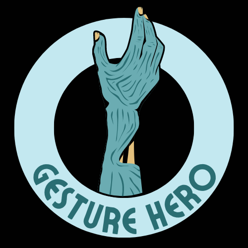
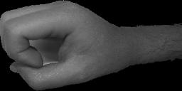
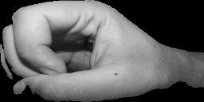
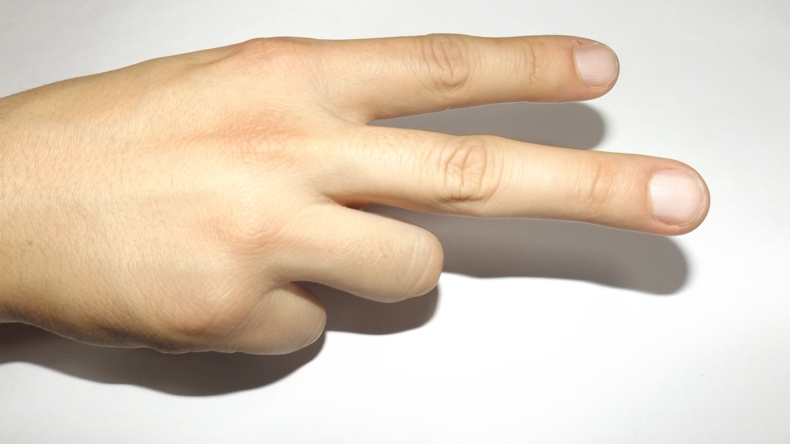
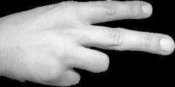
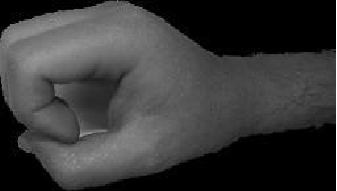
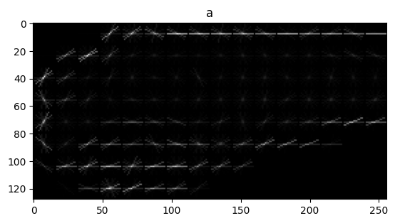
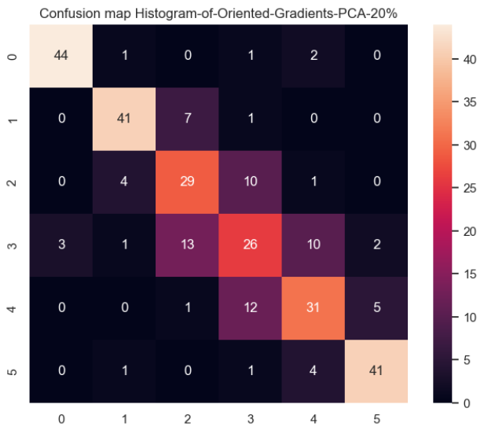
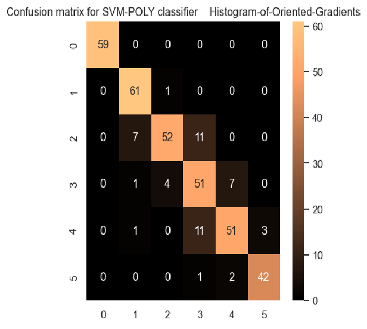

<h1 align="center" id="title">Gesture Hero</h1>


    

<p id="description">Gesture Hero is a hand gesture classification system that's build to differentiate between hand gestures representing numbers from 0-5.</p>

<h2>🛠️ Installation Steps:</h2>

<p>1. Installing required packages</p>

```
pip install -r requirements.txt
```

<p>2. To run for a specific dataset</p>

```
python ./main.py
```

<h2>💻 Built with</h2>

Technologies used in the project:


<div align="center">
	<code></code>
	<code></code>
	<code><img height="50" src="data:image/png;base64,iVBORw0KGgoAAAANSUhEUgAAAMoAAAD5CAMAAABRVVqZAAABIFBMVEX/////AAAAAP8A/wAAAACBgYGl/6Xn5+fU1NSsrKxMTExJSUny8vIbGxvGxsb8/Pzg4OD9/f/X19eysrJ6enqJiYk3NzfMzMz/8/P7//v29vb/pqb/19f/4uL2//Z3d//w8P9VVVWenp5sbGy9vb3/6ur/sbHs/+zNzf/k5P/U1P+SkpILCwubm5v/MDD/cnL/h4f/YmL/l5f/yMj/VFT/vr7K/8oq/yre/96c/5zFxf+L/4tL/0upqf+2/7YdHf9tbf+5uf+env9cXP88/zwpKSn/Hx//SEj/LCxh/2FW/1bW/9bf3/9mZv9CQv8pKf9w/3A6Ov+Ghv98fP//kZH/PT3/Tk7/bm7A/8BVVf8xMf+iov+Tk/+W/5ZLS/99/32LohL3AAAQjElEQVR4nO1de1/TOhiGwdjm7ncciINNEQcqqMwDCAOdihdEvHtEvv+3OGubtEmavG+alXae356/3Nq075O892Q4M3NtWLz1eOfR9utXsxYevP7+6O7jO8Xre921YXln2+HA48HDu7fiFi0Qlr+8kdCgeL2zHLeAmriz9BXg4eDb3b9A0xYfoTwcTdtZjFtUGLpEbCxNMpkdmaUDK/M0boFVWH4QiIiFJ5PpzoLoloe7cYvtx50nRkxmZ7cnzZctGxIZ4etkKdlTcyYjPI5bfAZLYzGZJIMZl8koxMRNgWBnbCaTsi7jr4mFSYiWj0NhMjsbf7Z8KyQms7N34qaCJ/S6eBIzE7NsRY4vsTIZLzSKiNNcFoMl9Ri+xpiOPQyVSZwqNkYOqUBsXmw7dCoPY2ISVnBkEZPlv74GKvEsy3UsyuxsLHWYpqU8eLiztLT05aFmD+NRDEy0kq8nd71el07XcoQYmmMaVcq2aMSPNcwrhioMVZhXspL9LkrlW+RM0PD4Xa4pi+jCRG74mH4pzbeIuYvINQyZXCg+IM2/qOuWO4g4UI67CO0jjRBxfowUKrC+I8E14uTlCyjMDjIarj0jNhbQdt9gKrIIUvkeCQMXYFTBFgVZ1NcRyO8Bnla8gAKznleR5i6gKNsaD/g23lSECNAH6fR/QQ2L1IWBqZSOJKAzj3S/BWx566g6qKGRtsKhDAx1xRZAvxHpDgVERasx95dQ0XnA30HlL1Ow/5HZg85YpwwEA1Okzvh/FCLByl4ncQGL0EgTFzidxI0FNJU3kaaTRXCPCK+dwNor4vYR2GpAgyS8qBG3wMcraeHREZ+sGKtNgbQDI25TIM1vsJdVRNrgUW+uIuJArQakPanjy0MFdvZAvU+CNVojP4SEtr+3Tdvf0e8So6cPXsnM9yk6LIajLhqnW/yqAgcUGzFsFeEbeLJIiW8VxXG6Hd1WlZYd2H5kHNuq6Ga3XOmxUfEcOkZ2IxVCwYsZeVBxACcvKk2BbSyuI2Fg41dpvlABGddxHVDv1T61CIyK7yjod6VMUDNMrZj4xsy1QR3xwKaJKnd5HefvP1QRD96DU+Vv8Z6aVqgYovPyM5cxqpcF+ZlWLGRLd/3jPjItVRa8+yPpOUfbMpJC4o/w4klyoCL+nxdITF9nV8I3AZPwow+/tmjNr5ApTMZPcUQuesnH8kQyEbhoJh9sFTopP/WywGwd6UYHxiFP0o8JR/pC48sr7eSD0n8zCb6LBf3hbQBP5JRuT+KPJz7YBhMkZD+dNDPxsPwkYKDbntQfqY+KqqVgVeCtyVySKaaY4v+G9d2F/dOD/pyN/sH5/uG79bhlMsDKj6uXcxIcXB2uxC1bEKwvvJXRoDj98bew2T2HeDjadvUsbik1cHiAErHx9l3ckiL40dcjYuEgOjLlctARzzRXhMLYn5UHvwPdf/HrXqD7b+4HIzJ3FejxDPYSicRGgPvfj+7/0Na//53U+UIw9GPli4QlWoARL6wBH7UX5p+gROYWDGiMsHGWsKGvMnvOgISeUt7EHbCIl2ZM7hG5Ep90Tbn8iQ550cbvXg9o7xZ2jZgcJ1w81xzy3BvyCeXyLDiRuVMjJicJBqhcNtrskI+ItzBhMmcU7p+zYiUutMZ85sZ8bEP3rpsw2Tdhcpzg8V5jzHthDMRlPUCA93AzBCaJFxqDfoqDAHsJHE4sHBowuS8KlUjsoYP2/IN+qu49NWFyYMCk7Rcq8QtzyOWPklG35fcGj4wWTByxT1Ms/IsMOpENShzLbt01YnJuwOS3VCjEIW/IB8kSuBUjkzfJiCWGAikLwW3FqD/+W6+MmFwGZzJzphAKdMgq/pJM4Z0Rk75BRvxcKZRkgl38UY7yqZiRHzZxxO0jtVBSG7bhi0MMBMU8NGJi4ohVOm/hSOWQywB/QTFvmi2KQUWvckQOVGWIwucRcKWb2aKYVMGfQaEUtTHMP5G4z9wbmSOWxXkWA+mogf4o3eh4ur9wePjPPinO/gnOZOZfRChuginuYYOY6KqTfPUvmbJk97w/1zdgApuvhU+SUb9QKif0Vp0q5VBI5VcufxhQwedXsiwbn9BBbnMAzyP3Q2pyQ57YkUmmYLhauhOAeeK+WRvCD1S/bisCy31sICmosXq+H1qrHtOvgXLkBsLll3PbAkIlvO2tC1Mm/rpehBPxEf8VlnbNgDlhAqsjoSwsQfNjOD6aRA8FkPgotXgPsMuwc0rYVAx7qFLApvIZGQ1PhG0sP0AqJtFDBXWlYgHdmoBzyvbojsuoFgVOJQfocHhZLPUEG/eGuw1ySBstFHgfbOYDNN4q28DOfajnDKDYcKQxHnRi/yJVl0mZqAYkyUBjPFi2jOL9CrQoxluMMoC6foKPl/cnKW4jVEI1FXBS1R0KBlCI/YBk+GG6Yjj30NqOhOz+RRhUdhfUYLtLIBUk1DuACuNQqEB9TbbUHH9VxqGi1bKDqLAhFqSiEVbIpr0CHxCz18olocya9eagB9PaI4Yq4wHSwddyxtAD2M3jMkRFZ18VnIsLJETqpGCghnJzAUlypvEmMLO2AhN4Ck+jFgY7m9ymBdgE0jizAxahVmAaN50Ep4LzG2A6iJ9agZscljcHW0d43w6u3LgGOVhwfETPucAlcXtm7NILPjnGZdawLKgPA/Xzo3UH3JvsIwcMkHKaGw13TY7a8JvgGtTZmIDbFMixD/icEr9/DGa2WJ6PbEw4mTVy/gtsHiE9WsFrgHaPZMdw44nkcNg+EVBJYkMFXw7rCMgF6TaTrT+ska9utGJMRP+H7V4pk8oysp7u1ip6Lk/hxrAOrd/OEC1RRZcN5VY/Bc1GUZHm9iV+bB2MjTZ8264nmEiJP5JzCCfoBpPr/TS2ivoL4laRxklkfwaHbUVaGPBkysew37PhdTaDbuCtaPzsYE6a9UAVh4s/J/edWS5v7F2gK2LBq0E1t1X7p/ujGvfySvfMq2SrTGMHz8Gvny9e/NFYDxtsWm222Y1AGlxRAzYBW4KaHUFAII1HyDaJEc7YTNTwYAgIxaE3fLs3MPi+wDUsiyJJ0LYWbYgFqMHxdRjKQ29Y4A4MsYVmdOwbgLpmwzZIg8K/Wxb0xzcIgHwaP1AQCG3/G0K1fLDrBG4ZBYUsmzY7PSnHS/AgSZgqNpC+AdyUDAbk+F54weVM0dwI/nMiBdCWE7zZGwBt1RtCMheNX4GgR5D0oG6aG54AF6B1tj2U6AI1A8KILm91mMyUtdJ9GHDn7NnY63Kg+cuc8blgPcBxuZxq/8aoPGZ4wTdiV8ay/UC748iZYxha22Rj+OSAm+PmKcwnzd8d4x0YBQIfbL+Pn7uVYqD9S/XgP4e2cGpw7LVsEmCOtM4rUBjkyYYnL+4FXpjb7WBvCPqnA67M/3ZAsCzmTMveeej+ZQoLp2MdtmrrNbtsIoF0y8XNQ02TGf/PbLT1VuZsL/AfpnDxTuOPn+yHcvytfIxFzKPbWudg1Fg/hLrc/fMQ/yTNxnN1LnM0OG6H8Ir1w3NpNnNwuWvyS2gI7b3fP312czQ4uW+uWD6s7y5cnR70+yNO/f7Lt+eXh++u6y8ElTfuHf+++Dz4MPj8+eLkmHTCw8bNFRthr8UUU0wxxRRTTBEhWqlUJZ1OV1KpVkwSFHOl0kiCdMlcgmIlU8tuznvIr/YKuTCFRFGqJlfzvARp5+9v5+bzFjZrsmGdTftinnxs9RrzEuRrqah45LakEjSq9tVV59NQslIpcmfW+ViVPcXBWjRM1BIkrcsZ8qGgHrmGMYmISwYQIDO6XmJ58eiQSyXrQ25T9RQbEehYCRTAuiPr/HPTNzRHbnL0awt80LzU1sLFKihAl5GxKQ6lGtWzP7n2Nkxmus3SCOlCpu59e+1+2VuURr1aSI8EqDSr9SH9ssPc4ptXql8V9kGNtPCCG6qZCBtr5EU3eF2mBtSwPHJDPq8teo/9qUs+lcQ3UDd37YZPZ1a0SqJ3eSu89eTzSoWv25/qLC/ZozrXIr+HIlGlVfECXRZrkivk34IPo7OQRgRWkwwV1AltiRcKjB0UqYZx//9Gi2QHQ+djQ/EgzzvYo1s5G87Lm9VMppuW5DW5Snd0qSpec8Y6z0lbYyuMztMJ74oPoxfsKa9z8y+QddaqSKJK1S8XvdEWq+b8uzVTzLjOLZvh5qjQYVKozY4XmouurE3X7666l5vkG5974aikZRpW44bS5fXNiTfadghJomwlLldqeM6ikp0X4Hkk+sIke7lD5qHLvoZFq2nlyOmms4JkmvLMDXQZiF+jvljicqkLS3tUVul37uRTcdPzfrgXnY+VOn+Z2DnVYySt4FfABl1PEm3oKvrmxKNSYKj4pp66i7x4gRHWobK5Jl7OcFSQkoKqe937ii5ygZ9NCRVO9xjdWK3VOp6apTh55rOd0VWXcImlMiSDXXvJFwNQaRFtarj2Sb34PPmGLpJkeWkorbJU8sSoWnSOnQhKxFuj7yExocdQscQg80elTweg4mqY68PoOtWEz5IHSal4zpBwsZUol+ce6t6/ylHJui6YMM0EodIl97k+jJoe9VgBqWS9y6Q4sN0HUVOfSRLfQh7kKTHR3TorIkYlJ/gwql95OjAglR5zneSbKU8cRksdn0F8GLN+RIyGN8GABDy4LNizcjdPCUiFDT8178lE2ZgYnmNf65+GrAEVqonEh1H9coM78CDqwRhnzOUNpB5qeo/tFlxU2fudf2fkVGg4QMtVKg/Jw6j/ciVvil94kMQVzmdnvIWi3sWHZohU3GozzQ7z1BaIKzQRqDBU2PdVw6FCZ6yCUqFZv5360grGSx4r6gdJcrDAVLo4FWqS/tSpV7PhjqOkb1gfaJHrSZRSPsg1o5Y2lRsishpUaFLoT2hJ0uBFK0Z8KjfjFjk3xYOrV9S2YplSnSEtAUiFVkwZ37AbIhWaYVQ94dhRxBH0fA/iq0jYg/X8a6ZPhVhz3TcsK16g1tuRNwTIg274BeBK5aR/8WreQmX8a6ZPJelTFQc0vDMFLlnAUR46LxGbRhqfN6ba2GPfxy7eqjew4C0QQStZHyGp4cHoPGyKElBbZaaPuq0K9VZcO6hLvqwJ/wFnkS5hgaXC9CzIpDUsA6n45q/EDoap0NAmdEpatJBgJshlQK2G0wMaQ+eHvULKaSUUc6lmjwZTkkYlfc+tMgJQWkXxqka095rWw6002SFqpdJbbnuSMQfaeKEloNANorNvIT9sjDBkS0KiwmK94q4mV690qJKkGqwYMBWuZ2wL0Bgy3zDJuGcOBEKfqDkPoslTGZHp9LZ6XnPFEdbdVsgme71ejeoGV68oqYC7Iry4QgtB9DMd+SM4YVw3o7helI8uaFGZGcpHO+CDFXdrVvwPdovApsAqfRChUhHbEVSRpTNL/R1GpQRwEZIArv8kCYYZxaOGGfERKf6tecYL+Hec3NEYlZlc0jfYQUPcs+PMQZaBtgo1X/enUW8y6+fmYK2eK3O+x4aCXIbrLDXW3ItFPxXHmJheQK666puLYbLg+y+aOU2WMHEeVilk1qy4Vl/LVJsl4SFsOpnO9Or1rap/TnLp7tro0uhak8th7C4j10eu2N8IiU4q3SUSbK1VmxV5RldKu1AlFwgkmfHfiimVScSUyiRiSmUSMaUyiZhSiQ7/AQUS4MEUROlrAAAAAElFTkSuQmCC" alt="Python" title="OpenCV"/></code>
	<code></code>
</div>

* Python
* scikit-learn
* OpenCV
* skimage
  span

<h2>📝 Project description</h2>
<p> Gesture Hero is a hand gesture classification system that's build to differentiate between hand gestures representing numbers from 0-5. Gesture Hero is a machine learning based tool, trianed on a dataset with almost 2000 pictures, using an excellent preprocessing, HOG features descriptor and SVM for an accurate answer to your problem.

<h2> 🧩 Project pipleline


<h2> 🎞️ Preprocessing </h2>

<p> Gesture Hero's strongest point is its preprocessing. By applying classical image processing techniques to preprocess the data for removing shadows, enhancing colors, clipping the area surrounding the hand, rotating so all hands would be pointing in the same direction and resizing for efficiency. </p>
<p>The main preprocessing approach taking is ignoring/ eliminating the channels with misleading information, mainly the ones that represent the illumination.
<p>Segmentation is done using the YCRB channels using a basic thresholding and ignoring the Y(illumination channel), then cropping the photo to only contain the hand by finding the maximum contours surrounding the hand. 
<p> To unify the orientations of hands, the preprocessed image is passed to a function to flip it so that the fingers are pointing to the left, based on the histogram of the image, the more dense half represents the palm while the other represents the fingers.

| Raw image                                      | Preprocessed                                   |
| ---------------------------------------------- | ---------------------------------------------- |
|  |  |
|  |  |
|  |  |

<h2>🪶 Feature extraction </h2>

<p> The main feature descriptor used is the Histogram of Gradients (HOG), since it’s robust to variations in appearance, computationally efficient, its discriminative power as it’s very efficient in capturing the distinguishing features of an object, and lastly its compatibility with machine learning algorithms.

| Preprocessed image                             | Visualized HOG                                 |
| ---------------------------------------------- | ---------------------------------------------- |
|  |  |
|  |  |

<h2>🏋️Model training and performance analysis </h2>

<p> The chosen model is a support vector machine (SVM) with an RBF kernel, trianed on the HOG extracted features.

<p> Resulting confusion matrix is as follows




<p> Noticing that there's a great confusion between 2,3 and 4 gestures, a 2 layer classification method is used to improve the performance.

<p> The fisrt layer is an SVM model trained on the whole dataset, if the result label is a 2, 3 or 4, the image is then passed to another SVM model that's only trained on the 2,3,4 dataset. This has significantly improved the accuracy of the classificatin.



<h2> 👥 Collaborators </h2>

| [Sarah Elzayat](https://github.com/SarahElzayat) | [Ahmed ata abdallah](https://github.com/Ahmed-ata112) | **[Doaa Magdy](https://github.com/doaamagdy2024)** | **[Rufaida Kassem](https://github.com/Rufaida-Kassem)** |
| --------------------------------------------- | -------------------------------------------------- | ----------------------------------------------------- | ---------------------------------------------------------- |
